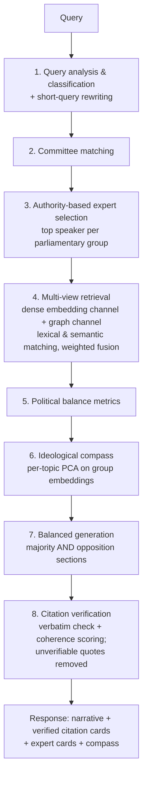

# ParliamentRAG

**Balanced, verifiable answers about Italian parliamentary debate — grounded in what was actually said, and by whom.**

ParliamentRAG is an authority-aware, multi-view Retrieval-Augmented Generation system over the stenographic records of the Camera dei Deputati (XIX Legislature). Ask a policy question and get a response that represents *every* parliamentary group — majority and opposition — with verbatim, verified citations linked back to the original transcripts.

**Live**: [www.parliamentrag.it](https://www.parliamentrag.it/)

<!-- screenshot: chat view with expert cards, citations, and ideological compass -->

- **151k+ text chunks** from **692 plenary sessions**, updated through 2026-07-17
- **Verified citations**: every quote is checked verbatim against its source chunk; unverifiable quotes are removed
- **Topic-aware authority scoring**: the most credible speaker per party is selected *for the specific question asked*
- **6 languages** (IT / EN / FR / DE / ES / PT), editorial newspaper-style UI

---

## Why

LLM summaries of parliamentary activity tend to favour dominant actors, quote out of context, and flatten disagreement. ParliamentRAG treats *what is said* and *who says it* as equally important: retrieval, generation, and presentation are all constrained to cover the full spectrum of parliamentary groups, and every claim is anchored to a verifiable span of the official record.

---

## System architecture

```
Next.js 16 (App Router, TypeScript, Tailwind v4, shadcn)
Chat · Search · Rankings · Compass · Timeline · Evaluation
        │  HTTP + Server-Sent Events (8-step progress)
        ▼
FastAPI backend (Python)
routers: query · chat · search · authority · compass · timeline · history · evaluation · evidence · graph · survey
        │  Bolt
        ▼
Neo4j 5.15 — knowledge graph + native vector index
speech chunks · acts · speakers · groups · committees · sessions
```

### Query pipeline

Each question runs through a single streamed pipeline; the frontend renders progress as an 8-step stepper.



1. **Query analysis** — the question is classified and, if short or ambiguous, rewritten for retrieval.
2. **Committee matching** — the query is mapped to the relevant parliamentary committees.
3. **Expert selection** — for each parliamentary group, the top speaker is chosen by a **query-specific authority score** with six components: *profession, education, committee membership, legislative acts, speech interventions, institutional role* (semantic components use the query embedding; activity components are time-decayed).
4. **Multi-view retrieval** — a dense channel (vector similarity over `text-embedding-3-small` embeddings) and a graph channel (lexical + semantic matching over the knowledge graph) are fused by a weighted merger balancing relevance, party coverage, speaker diversity, and political salience.
5. **Balance metrics** — coverage and balance statistics are computed over the retrieved evidence.
6. **Ideological compass** — a per-topic PCA over group embeddings positions parliamentary groups on latent debate axes.
7. **Generation** — a multi-stage writer produces a narrative that explicitly represents both majority and opposition positions.
8. **Citation verification** — every quotation is matched verbatim against its source chunk and coherence-scored; anything that cannot be verified is stripped from the answer.

### Models

| Role | Model |
|---|---|
| Writer / Integrator | `gpt-4.1` |
| Analyst (claim decomposition) | `gpt-4.1-mini` |
| Query rewriter, UI translations | `gpt-4.1-nano` |
| Embeddings (all semantic operations) | `text-embedding-3-small` (1536-d, Neo4j native vector index) |

---

## Features

| Page | What it does |
|---|---|
| `/` | Landing page |
| `/home` (chat) | Ask questions; streamed 8-step progress, per-party sections, **verified citation cards** with full stenographic text in a modal, **expert cards** with authority-score breakdown, inline ideological compass |
| `/search` | Search parliamentary acts and records |
| `/ranking` | Topic-dependent authority rankings of deputies |
| `/compass` | Standalone ideological compass for any topic |
| `/timeline` | **Lavori d'Aula** — browse sessions → debates → phases → speakers, with AI-generated IT/EN recaps per session and debate, per-speaker position summaries, infinite scroll, and search + date filters |
| `/valutazione` | Evaluation dashboard: automated metrics and blind A/B comparison vs. a baseline LLM |
| `/explorer` | Interactive knowledge-graph exploration |

**UI**: editorial newspaper-style design (Fraunces serif), light/dark themes, mobile bottom navigation, and full internationalization in 6 languages (`frontend/messages/{it,en,fr,de,es,pt}.json` via `next-intl`).

---

## Data

The knowledge graph is built from **official Camera dei Deputati open data**: stenographic XML reports of plenary sessions and the Camera SPARQL endpoints (deputies, groups, committees, acts, roles).

- XIX Legislature, 692 sessions, 151k+ speech chunks (as of 2026-07-17)
- Incremental updates: `make update-data` ingests new sessions (transcripts, acts, roles, embeddings) and runs automatic post-update graph repairs (e.g. speaker-link deduplication)
- The "data updated on" date shown in the app is derived from the database automatically

<p align="center"></p>

---

## Quickstart

**Prerequisites**: Python 3.13+, Node.js 20+, Docker (for a local Neo4j), an OpenAI API key, and a populated Neo4j database.

```bash
# 1. Configure environment
cp .env.example .env   # set OPENAI_API_KEY, NEO4J_URI, NEO4J_USER, NEO4J_PASSWORD

# 2. Install backend (venv) + frontend deps
make install

# 3. Run backend (:8000) + frontend (:3000) together
make dev
```

`make dev` picks the next free ports automatically if the defaults are busy; `Ctrl+C` stops both. API docs are served at `http://localhost:8000/docs`.

Other useful targets:

```bash
make dev-backend / make dev-frontend   # run one side only
make stop                              # free the dev ports
make build                             # production build of the frontend
make update-data                       # incremental data ingestion + graph repairs
make db-backup                         # dated dump of the production Neo4j
make db-pull                           # restore latest dump into a local Neo4j (:7691)
make db-use-local / db-use-remote      # switch NEO4J_URI between local copy and production
```

The production instance at [parliamentrag.it](https://www.parliamentrag.it/) auto-deploys from `main` (Railway).

---

## Configuration

### Environment (`.env`)

| Variable | Description |
|---|---|
| `NEO4J_URI` | Bolt connection URI |
| `NEO4J_USER` / `NEO4J_PASSWORD` | Neo4j credentials |
| `OPENAI_API_KEY` | Single key, or comma-separated list for rate-limit distribution |
| `LOG_LEVEL` | `DEBUG` / `INFO` / `WARNING` / `ERROR` |
| `NEXT_PUBLIC_API_URL` | Backend API URL as seen from the browser |

### Algorithmic parameters (`backend/config/default.yaml`)

| Section | Controls |
|---|---|
| `retrieval.dense_channel` / `retrieval.graph_channel` | top-k, similarity thresholds, lexical matching |
| `retrieval.merger` | fusion weights — relevance 0.35, salience 0.25, coverage 0.20, diversity 0.15, authority 0.05 |
| `authority.weights` | interventions 0.25, committee 0.25, acts 0.20, profession 0.15, education 0.10, role 0.05 |
| `authority.time_decay` | half-life for acts and speeches |
| `generation.models` | per-stage model selection |
| `query_rewriting` | short-query expansion (model, word threshold) |
| `coalitions` | majority / opposition group lists |

`backend/config/commissioni_topics.yaml` maps committee names to topic areas for committee-based filtering.

---

## API overview

All routes are mounted under `/api` (interactive docs at `/docs`).

| Endpoint | Description |
|---|---|
| `POST /api/chat` | Streaming query pipeline (SSE: `progress`, `experts`, `citations`, `section`, `compass`, `complete`) |
| `GET /api/evidence/{id}` | Full evidence item with source transcript |
| `GET /api/search` | Parliamentary acts and record search |
| `GET /api/authority` | Topic-dependent authority rankings |
| `GET /api/compass` | Standalone ideological compass |
| `GET /api/timeline` | Sessions, debates, phases, speaker summaries |
| `GET /api/history` | Chat history |
| `GET /api/evaluation/dashboard` | Automated metrics + A/B results |
| `POST /api/surveys` | Submit A/B evaluation |
| `GET /api/graph` | Knowledge-graph exploration |

---

## Evaluation

The system ships with a two-level evaluation framework over 15 predefined policy topics (`backend/evaluation_set.json`, with pre-computed query-specific baseline experts):

- **Automated metrics** (`/api/evaluation/dashboard`): parliamentary-group coverage, citation relevance and faithfulness, coalition balance, authority distribution — computed for both the system and the baseline on the same topics.
- **Blind A/B protocol** (`/valutazione`): side-by-side comparison of system vs. baseline responses, rated on 9 dimensions on a 1–5 Likert scale. Analysis uses Mann–Whitney U, Cohen's *d*, and Krippendorff's *α* for inter-rater agreement.

In the original study against Google NotebookLM (6 domain experts), the system scored higher on group coverage (97% vs. 95%) and citation faithfulness (100% vs. 95%), with human ratings favouring it on source and balance dimensions (Cohen's *d* up to 0.35) and overall satisfaction at parity. Full details in the [research report](Who_Speaks_Matters__Authority_Aware_Multi_View_Parliamentary_RAG.pdf).

---

## Data attribution

Parliamentary data are sourced from the **Camera dei Deputati open data** program ([dati.camera.it](https://dati.camera.it/)) — stenographic reports and SPARQL endpoints — released under their respective open licenses. ParliamentRAG is an independent project and is not affiliated with or endorsed by the Camera dei Deputati.

---

## Citation

If you use this system or build on this work in academic contexts, please cite:

```bibtex
@misc{tritella2026whospeaksmatters,
  author = {Tritella, Mirko and Pozzi, Riccardo and Palmonari, Matteo},
  title  = {Who Speaks Matters: Authority-Aware Multi-View {RAG} over Italian Parliamentary Proceedings},
  year   = {2026},
  note   = {University of Milano-Bicocca}
}
```

---

## License

[Apache 2.0](LICENSE)
