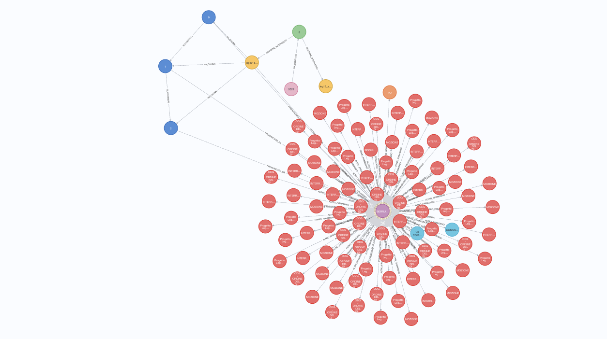
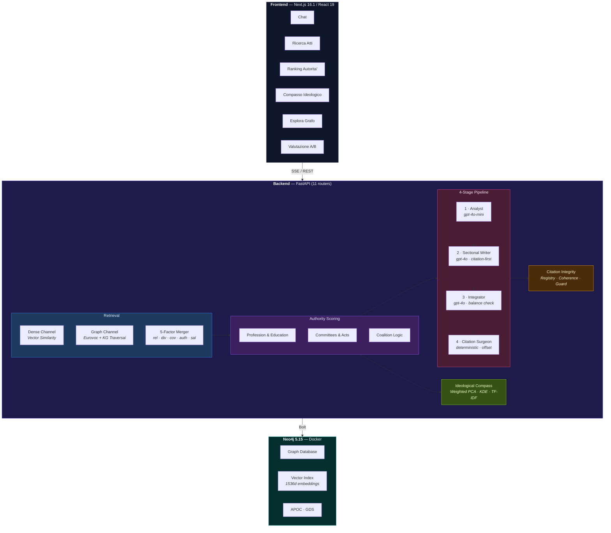
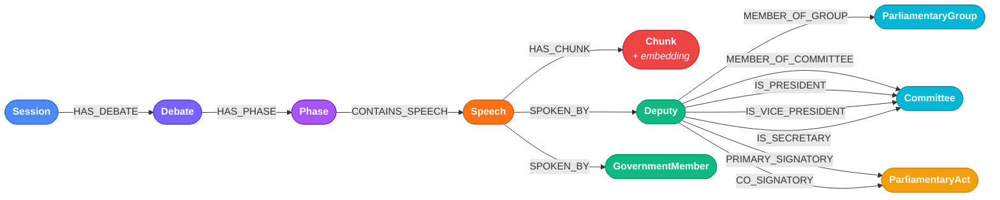

<div align="center">

# ParliamentRAG

### Multi-View RAG for Italian Parliamentary Data

A Retrieval-Augmented Generation system that delivers **balanced, multi-view analysis** of Italian parliamentary debates (XIX Legislatura) — ensuring all 10 parliamentary groups are represented in every response, with deterministic offset-based citations and query-dependent authority scoring.

[](https://python.org)
[](https://fastapi.tiangolo.com)
[](https://nextjs.org)
[](https://neo4j.com)
[](https://openai.com)
[](LICENSE)

[](https://www.parliamentrag.it)

</div>

---

## Overview

ParliamentRAG is a research system built for a Master's thesis in Data Science that combines **vector search** and **knowledge graph traversal** to analyze Italian parliamentary debates. It enforces balanced political representation by guaranteeing that all 10 parliamentary groups appear in every generated response.

The system features a **4-stage generation pipeline** (Analyst → Sectional Writer → Integrator → Citation Surgeon) with **deterministic, offset-based citations** — zero fuzzy matching — ensuring full auditability and traceability of every quoted passage. A **5-factor merger** (relevance, diversity, coverage, authority, salience) and **embedding-based coherence validation** guarantee both quality and fairness of the output.

<div align="center">
  <a href="https://www.parliamentrag.it">
    
  </a>
  <br/>
  <sub>Knowledge graph of Italian parliamentary data in Neo4j — <a href="https://www.parliamentrag.it"><b>Try the live demo</b></a> · <a href="https://www.parliamentrag.it/explorer"><b>Interactive schema explorer</b></a></sub>
</div>

---

## Key Features

**Dual-Channel Retrieval** — Combines dense vector similarity search (Neo4j native vector index, top_k=200) with structured graph traversal (hybrid Eurovoc matching on `ParliamentaryAct` nodes) for comprehensive evidence gathering

**5-Factor Merger Scoring** — Combines relevance (0.15), diversity (0.15), coverage (0.25), authority (0.25), and salience (0.20) to produce a balanced, high-quality result set. Salience penalizes procedural boilerplate ("il parere e' favorevole", "ringrazio il Presidente")

**Query-Dependent Authority Scoring** — Ranks speakers by topic-specific credibility across 6 components: profession (0.10), education (0.10), committee (0.20), acts (0.25), interventions (0.30), role (0.05) — with exponential time decay and coalition-aware temporal logic that invalidates authority on majority↔opposition crossing

**Ideological Compass** — Data-driven 2D positioning of parliamentary groups using weighted PCA on text embeddings (IC-1 → IC-6 pipeline), with KDE clustering, TF-IDF axis labeling, and configurable soft anchors (disabled by default)

**4-Stage Generation Pipeline** — Analyst (gpt-4o-mini) → Sectional Writer (gpt-4o) → Integrator (gpt-4o) → Citation Surgeon (deterministic), each stage independently verifiable

**Citation-First Writing** — The LLM sees the pre-extracted citation *before* writing the intro text, then inserts a `[CIT:id]` placeholder. The deterministic Surgeon replaces it with the verbatim offset-based quote. Zero fuzzy matching — every citation is auditable

**5-Level Citation Integrity** — Citation Registry (state tracking) → Citation-First Writer (coherence by construction) → Integrator Guard (citation preservation) → Coherence Validator (embedding cosine similarity, threshold 0.6) → Final Completeness Check

**Mandatory Multi-View Coverage** — All 10 parliamentary groups are represented in every response. Post-generation balance check ensures majority/opposition word ratio ≤ 2:1 (Coverage-based Fairness, NAACL 2025)

**Semantic Deduplication** — MMR-inspired cross-speaker deduplication using embedding cosine similarity > 0.85, keeping the most authoritative source

**Real-Time Streaming** — SSE-based streaming with visible pipeline progress across 9 event types (progress, commissioni, experts, citations, balance, compass, citation_details, chunk, complete)

**A/B Evaluation** — Integrated baseline pipeline (authority neutralized, no Surgeon/Coherence) with blind A/B comparison at `/valutazione`

---

## Architecture



---

## Tech Stack

| Layer | Technology |
|-------|-----------|
| **Frontend** | Next.js 16.1, React 19, TypeScript 5, Tailwind CSS 4, shadcn/ui, react-force-graph-2d |
| **Backend** | FastAPI, Python 3.10+, Pydantic 2, spaCy (Italian NLP) |
| **Database** | Neo4j 5.15 (Graph + Native Vector Index), APOC, Graph Data Science |
| **LLM** | OpenAI GPT-4o (generation), GPT-4o-mini (analysis) |
| **Embeddings** | text-embedding-3-small (1536 dimensions) |
| **Infrastructure** | Docker, Docker Compose, Uvicorn |

---

## Frontend Pages

| Page | Route | Description |
|------|-------|-------------|
| **Ricerca Topic** | `/` | Main chat interface with multi-view RAG analysis |
| **Ricerca Atti** | `/search` | Full-text and semantic search of parliamentary records |
| **Ranking Autorita'** | `/ranking` | Deputy authority scores ranked by topic |
| **Compasso Ideologico** | `/compass` | Standalone ideological positioning analyzer |
| **Esplora Grafo** | `/explorer` | Interactive Neo4j schema browser with Cypher editor |
| **Valutazione** | `/valutazione` | A/B evaluation dashboard with automated metrics |
| **Cronologia** | `/chat/[id]` | Load and review saved conversations |

The sidebar organizes pages into two sections: **Strumenti** (Search, Ranking, Compass) and **Avanzate** (Graph Explorer, Evaluation).

---

## Getting Started

### Prerequisites

- Python 3.10+
- Node.js 18+
- Docker & Docker Compose
- OpenAI API Key

### 1. Clone and configure

```bash
git clone https://github.com/Emeierkeio/thesis-ParliamentRAG.git
cd thesis-ParliamentRAG

# Set up environment variables
cp .env.example .env
# Edit .env with your OpenAI API key and Neo4j credentials
```

### 2. Start Neo4j

```bash
docker compose up -d neo4j
```

### 3. Start the Backend

```bash
cd backend
python -m venv venv
source venv/bin/activate    # Windows: .\venv\Scripts\activate

pip install -r requirements.txt
python -m spacy download it_core_news_sm

uvicorn app.main:app --reload --port 8000
```

### 4. Start the Frontend

```bash
cd frontend
npm install
npm run dev
```

### 5. Access the application

| Service | URL |
|---------|-----|
| Frontend | http://localhost:3000 |
| API Docs (Swagger) | http://localhost:8000/docs |
| Neo4j Browser | http://localhost:7475 |

---

## API Reference

The backend exposes **11 routers** with the following endpoints:

### Chat & Query

| Endpoint | Method | Description |
|----------|--------|-------------|
| `/api/chat` | POST | Main chat endpoint with SSE streaming |
| `/api/chat/task/{task_id}` | GET | Poll async task status |
| `/api/query` | POST | Alternative query endpoint |
| `/api/evidence/{id}` | GET | Full evidence details |
| `/api/evidence/{id}/verify` | GET | Verify citation integrity |
| `/api/health` | GET | Health check |

### Search & Graph

| Endpoint | Method | Description |
|----------|--------|-------------|
| `/api/search/results` | GET | Parliamentary record search |
| `/api/search/deputies` | GET | Deputy list with filters |
| `/api/search/groups` | GET | Parliamentary groups |
| `/api/search/speech/{chunk_id}` | GET | Full speech by chunk ID |
| `/api/search/act/{act_uri}` | GET | Parliamentary act details |
| `/api/graph/schema` | GET | Neo4j graph schema |
| `/api/graph/stats` | GET | Database statistics |
| `/api/graph/query` | POST | Execute Cypher queries |

### Specialized Analysis

| Endpoint | Method | Description |
|----------|--------|-------------|
| `/api/authority-ranking` | POST | Rank deputies by authority on a topic |
| `/api/compass` | POST | Compute ideological compass |

### Configuration

| Endpoint | Method | Description |
|----------|--------|-------------|
| `/api/config` | GET | System configuration |
| `/api/config` | PUT | Update configuration |
| `/api/config/parties` | GET | Parliamentary parties |
| `/api/config/coalitions` | GET | Coalition mappings |

### History

| Endpoint | Method | Description |
|----------|--------|-------------|
| `/api/history` | GET | List conversations |
| `/api/history` | POST | Save conversation |
| `/api/history/{id}` | GET | Load conversation |
| `/api/history/{id}` | DELETE | Delete conversation |
| `/api/history` | DELETE | Clear all history |

### Evaluation & Surveys

| Endpoint | Method | Description |
|----------|--------|-------------|
| `/api/evaluation/dashboard` | GET | A/B evaluation metrics |
| `/api/evaluation/metrics/{chat_id}` | GET | Automated metrics for a chat |
| `/api/evaluation/export/csv` | GET | Export evaluations as CSV |
| `/api/surveys` | GET | List surveys |
| `/api/surveys` | POST | Submit survey |
| `/api/surveys/questions` | GET | Survey questions |
| `/api/surveys/stats/summary` | GET | Survey statistics |
| `/api/surveys/chats/evaluated` | GET | Evaluated chats |
| `/api/surveys/chats/pending` | GET | Pending evaluations |
| `/api/surveys/{chat_id}` | GET/PUT/DELETE | Manage specific survey |

Full interactive documentation available at `/docs` when the backend is running.

---

## Configuration

All weights and thresholds are managed through YAML configuration in `config/default.yaml`:

```yaml
# Retrieval merger weights (5-factor scoring)
retrieval:
  dense_channel:
    top_k: 200
    similarity_threshold: 0.3
  graph_channel:
    semantic_similarity_threshold: 0.4
  merger:
    relevance_weight: 0.15   # Semantic similarity
    diversity_weight: 0.15   # Penalizes speaker dominance
    coverage_weight: 0.25    # Favors party representation
    authority_weight: 0.25   # Query-dependent credibility
    salience_weight: 0.20    # Political substantiveness (vs procedural)

# Authority scoring components
authority:
  weights:
    profession: 0.10
    education: 0.10
    committee: 0.20
    acts: 0.25               # Time decay: half-life 365 days
    interventions: 0.30      # Time decay: half-life 180 days
    role: 0.05
  normalization: "percentile"

# Generation model selection
generation:
  models:
    analyst: "gpt-4o-mini"   # Stage 1: query decomposition (cost optimized)
    writer: "gpt-4o"         # Stage 2: per-party sections
    integrator: "gpt-4o"     # Stage 3: narrative coherence
    # Stage 4 is deterministic (no LLM)
  parameters:
    temperature: 0.3
    max_tokens: 4000

# Citation integrity
citation:
  method: "offset"           # ONLY offset-based, NO fuzzy matching
  integrity:
    min_coherence_score: 0.2 # Embedding cosine similarity threshold
    enable_registry: true
    integrator_guard: true
    evidence_first_mode: true
```

---

## Database Schema

The Neo4j knowledge graph models Italian parliamentary data through the following entity-relationship structure:



> **Vector Index** — Each `Chunk` node stores a 1536-dimensional embedding (`text-embedding-3-small`) indexed via Neo4j's native vector search for dense retrieval.

---

## Testing

```bash
cd backend
source venv/bin/activate

# Run all tests
pytest tests/ -v

# Run specific critical tests
pytest tests/test_authority_coalition.py -v   # Coalition-aware temporal logic
pytest tests/test_citation_exact.py -v        # Offset-based citation extraction
```

---

## Documentation

| Document | Topic |
|----------|-------|
| [docs/architecture.md](docs/architecture.md) | System architecture and data flow |
| [docs/retrieval.md](docs/retrieval.md) | Dual-channel retrieval strategy |
| [docs/authority_score.md](docs/authority_score.md) | Authority scoring methodology |
| [docs/generation_pipeline.md](docs/generation_pipeline.md) | 4-stage generation pipeline |
| [docs/citation_integrity.md](docs/citation_integrity.md) | Offset-based citation system |
| [docs/ideological_compass.md](docs/ideological_compass.md) | Ideological compass (IC-1 → IC-6) |
| [docs/design_choices.md](docs/design_choices.md) | Architectural decisions |
| [docs/evaluation.md](docs/evaluation.md) | Evaluation methodology |
| [docs/scelte.md](docs/scelte.md) | 24 design choices with rationale |
| [docs/slides.md](docs/slides.md) | Marp presentation slides |
| [docs/thesis.md](docs/thesis.md) | Full thesis document (Chapters 1-8) |
| [config/default.yaml](config/default.yaml) | All weights, thresholds, and parameters |

---

## Project Structure

```
ParliamentRAG/
├── backend/
│   ├── app/
│   │   ├── main.py              # FastAPI entry point (11 routers)
│   │   ├── config.py            # Settings & YAML config loader
│   │   ├── models/              # Pydantic data models
│   │   │   ├── evidence.py      # UnifiedEvidence schema
│   │   │   ├── compass.py       # Compass analysis models
│   │   │   ├── authority.py     # Authority scoring models
│   │   │   ├── evaluation.py    # A/B evaluation models
│   │   │   ├── survey.py        # User survey models
│   │   │   └── query.py         # Query/response models
│   │   ├── routers/             # API endpoints (11 routers)
│   │   │   ├── chat.py          # SSE streaming chat
│   │   │   ├── query.py         # Alternative query + health
│   │   │   ├── evidence.py      # Evidence details + verification
│   │   │   ├── config.py        # Configuration + parties + coalitions
│   │   │   ├── history.py       # Conversation persistence
│   │   │   ├── graph.py         # Schema, stats, Cypher queries
│   │   │   ├── search.py        # Records, deputies, groups, speeches, acts
│   │   │   ├── authority.py     # Deputy ranking by topic
│   │   │   ├── compass.py       # Standalone ideological compass
│   │   │   ├── evaluation.py    # A/B dashboard + metrics + export
│   │   │   └── survey.py        # User surveys (CRUD + stats)
│   │   └── services/
│   │       ├── neo4j_client.py  # Database client
│   │       ├── task_store.py    # Async task tracking
│   │       ├── retrieval/       # Dense + Graph channels, 5-factor Merger
│   │       ├── authority/       # Authority scoring, Coalition logic
│   │       ├── generation/      # 4-stage pipeline, Citation Registry,
│   │       │                    # Coherence Validator, Evidence-First Writer
│   │       ├── compass/         # Ideological compass (PCA, KDE, TF-IDF)
│   │       └── citation/        # Sentence extraction, Salience scoring
│   ├── config/                  # YAML configuration
│   ├── logs/                    # Rotating log files (auto-generated)
│   ├── requirements.txt
│   └── Dockerfile
├── frontend/
│   └── src/
│       ├── app/                 # Next.js App Router (7 pages)
│       │   ├── page.tsx         # Ricerca Topic (main chat)
│       │   ├── search/          # Ricerca Atti
│       │   ├── ranking/         # Ranking Autorita'
│       │   ├── compass/         # Compasso Ideologico
│       │   ├── explorer/        # Esplora Grafo
│       │   ├── valutazione/     # Valutazione A/B
│       │   └── chat/[id]/       # Cronologia conversazioni
│       ├── components/
│       │   ├── ui/              # shadcn/ui primitives
│       │   ├── chat/            # ChatArea, ExpertCard, CitationCard, CompassCard
│       │   ├── layout/          # Sidebar with Strumenti/Avanzate sections
│       │   ├── search/          # Deputy/Group selectors, results
│       │   ├── graph/           # Graph visualizer (react-force-graph-2d)
│       │   ├── evaluation/      # Charts, comparison views
│       │   ├── survey/          # Survey modal
│       │   ├── settings/        # Configuration editors
│       │   └── shared/          # Progress indicators
│       ├── hooks/               # Custom React hooks
│       ├── types/               # TypeScript definitions
│       └── lib/                 # Utilities
├── config/                      # Shared YAML configuration
│   ├── default.yaml             # All weights, thresholds, parameters
│   └── commissioni_topics.yaml  # Committee topic mappings
├── docs/                        # Technical documentation (11 files + PDF)
├── assets/                      # Images and visual assets
├── neo4j/                       # Neo4j Docker data volumes
├── docker-compose.yml           # Neo4j 5.15 + APOC + GDS
├── .env.example                 # Environment template
└── LICENSE
```

---

## Author

**Mirko Tritella** — Tesi di Laurea Magistrale in Data Science

Università degli Studi di Milano - Bicocca

---

## License

This project is licensed under the MIT License — see the [LICENSE](LICENSE) file for details.
